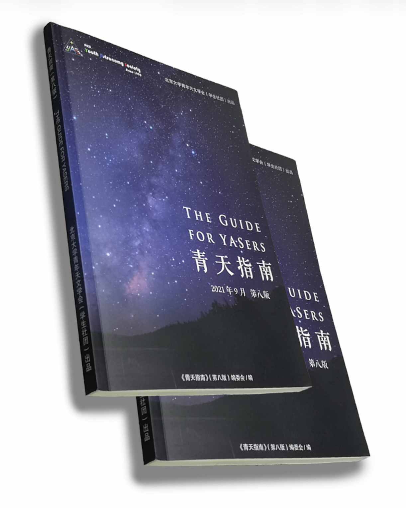
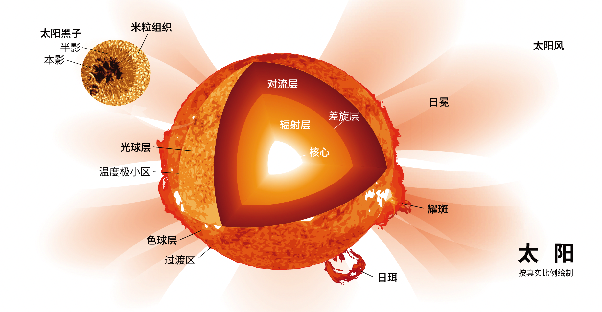
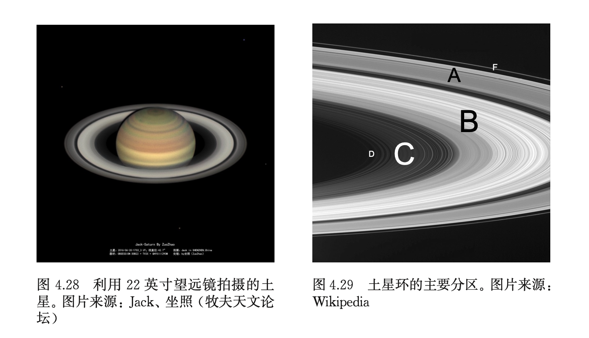
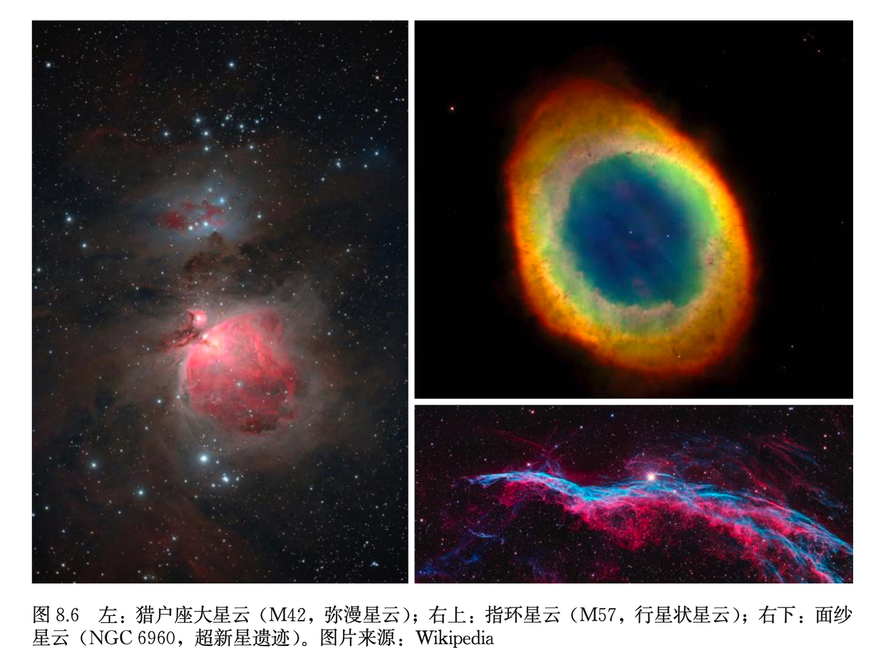
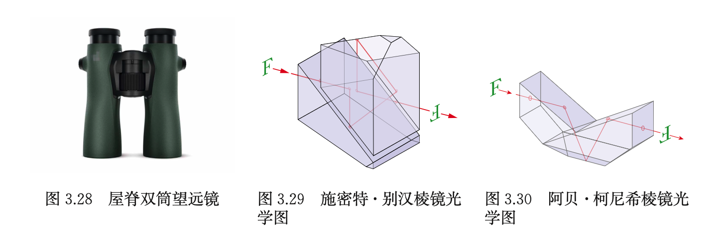
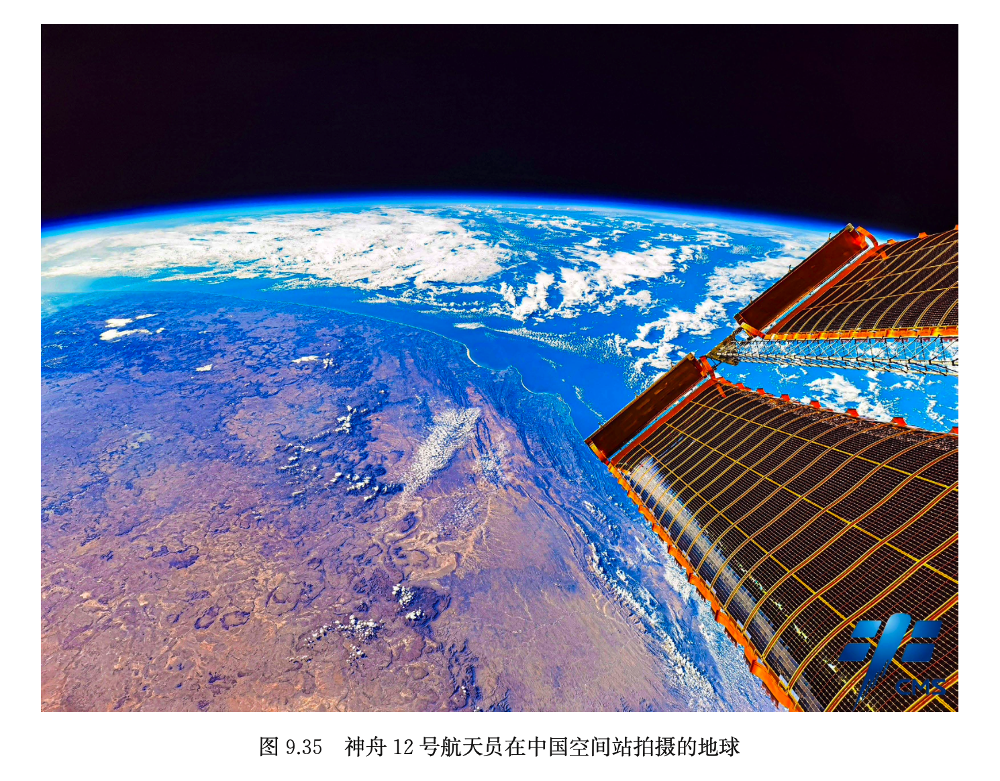
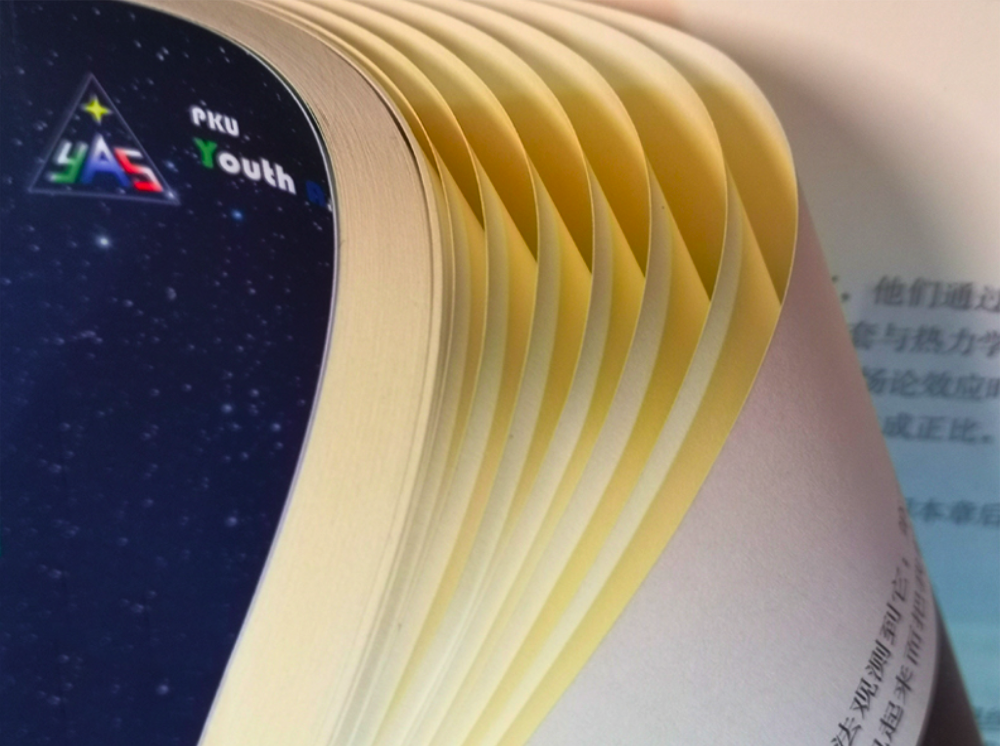
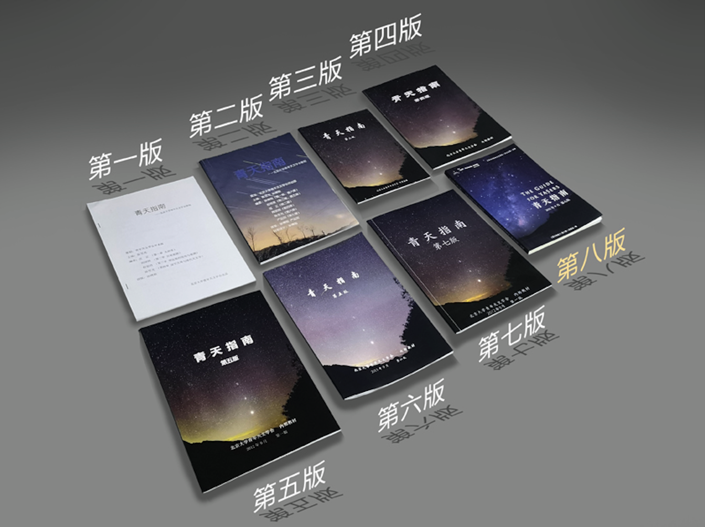
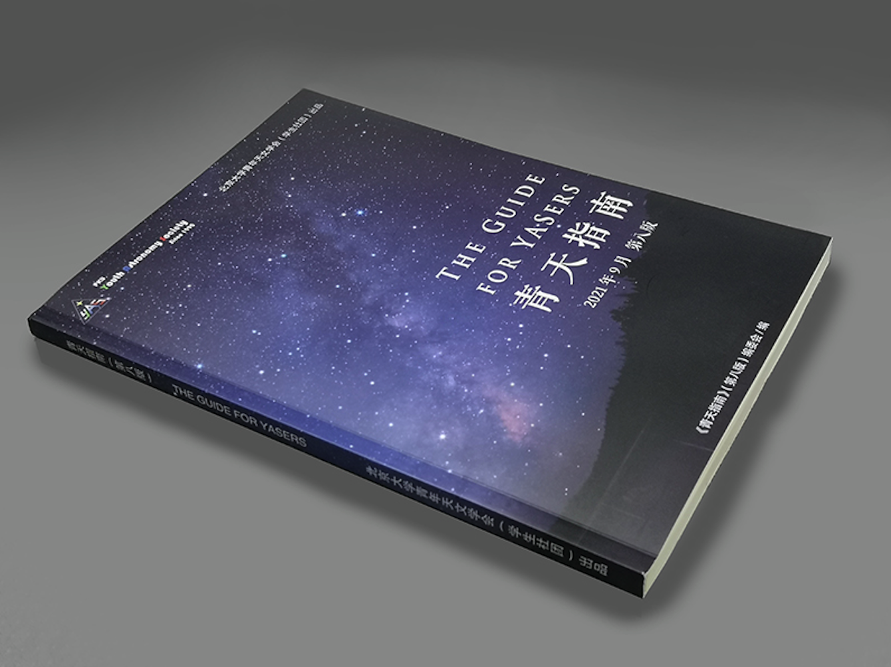

## 青天指南[^1]，强得很。

> **你的下一款天文教材，何必是教材。**

- **免费领取** | 新会员  
- **25 RMB** | 第二本与非会员[^2]

[进一步了解>]() &nbsp;&nbsp;   [购买>]()

[^1]: 出于环保原因，补充阅读不再印出。
[^2]: 老版本《青天指南》不参与换购，不包括运费。

## 焕然一新，如日方升。  
修订《星空导览》《深空天体》《资源》三章。重新编写《天文望远镜》《太阳系》《特殊天象》《青年天文学会简介》四章。新增《时间、历法和星空文化》《恒星》《太空探索》三章。纷繁奇妙，待您探索。

## LaTeX引擎，动力澎湃。
采用专业的LaTeX排版引擎进行排版，图片清晰、版面美观，力求达到出版效果；电子版中使用了hyperref宏包，让PDF文件特别适合在电子设备上阅读。

## 甄选图片，尽态极妍。
全书精选213张天文学照片与插图，对第七版不清晰的插图进行替换，部分插图甚至进行了矢量化，尽享宇宙浩瀚与星河烂漫。

## 包罗万象，推陈出新。
与第七版相比，现版本删除了已经过时的天文学知识与信息，对标天文学前沿领域，包揽国内外最新消息。万象更新，期待您的品鉴。

## 道林纸张，匠心甄选。
精选80g米黄色道林纸，对比度、伸缩率和表面强度有较高的提升，酸碱性也应接近中性或呈弱碱性。米黄色的纸张映衬出柔和的质感，阅读起来更加护眼，让您充满阅读的欲望。

## 涛声依旧，一脉相承。
1990年4月25日，哈勃空间望远镜升空翌日，学会初创。  

2012年9月，《青天指南》第一版诞生。学会三十余年筚路蓝缕，指南近十年薪火相传，第八版《青天指南》定会带给你厚重的阅读体验。

## 青天指南，强得很。

- **免费领取** | 新会员
- **25 RMB** | 第二本与非会员[^2]